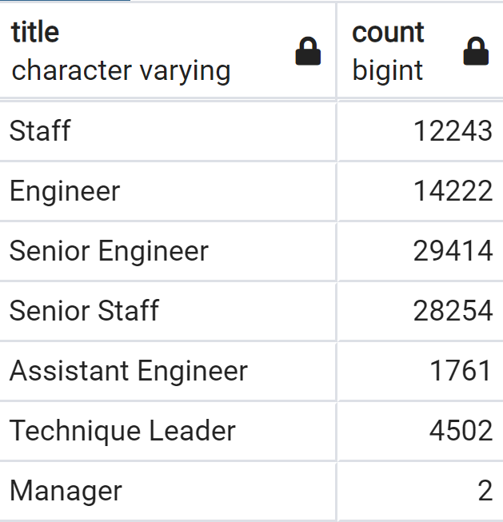

# Pewlett-Hackard-Analysis

Resource:https://gfycat.com/qualifiednauticalbluet-chuck-parks-music

### Overview of the analysis:
Using SQL techniques, we need to determine the number of retiring employees by title and identify which employees are eligible to participate in the mentorship program. We used employees born between January 1 1952 and December 31, 1955.

### Results: 
The COUNT function was useful to create a Retiring Titles table that shows the number of retirement-age employees by job title. It is interesting to see that there were only a handful of manager positions. This could be a good opportunity for HR to investigate why there were so few managers. Also, retiring titles show us the majority of the employees of retirement age have senior titles.

To identify the employees who are eligible to participate in a mentorship program, I created a Mentorship Eligibility table that holds the employees who were born between January 1, 1965, and December 31, 1965. On the other hand, One of the most interesting things in the table down that most of these employees have senior titles.

